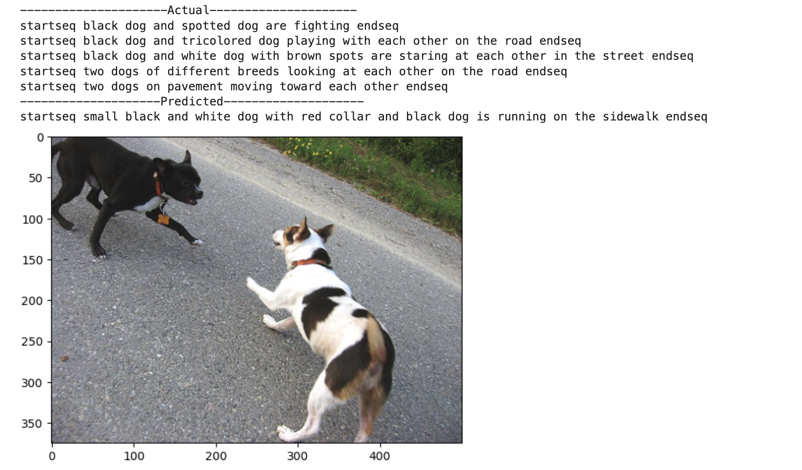

# Image Caption Generation

This project implements an image caption generation model using deep learning techniques. The model processes images and generates descriptive captions using a combination of Convolutional Neural Networks (CNNs) and Recurrent Neural Networks (RNNs). The quality of generated captions is evaluated using the **BLEU (Bilingual Evaluation Understudy) score**, a widely used metric for measuring the accuracy of machine-generated text against human references.


## Preview Image
Include a preview image of the model's output here:




## Features
- Uses CNN (e.g., InceptionV3) for image feature extraction.
- Implements an LSTM-based decoder for caption generation.
- Tokenization and vocabulary handling with a custom word index.
- Evaluation using **BLEU Score** to measure the quality of generated captions.

## Installation
To set up the project, install the required dependencies:

```sh
pip install tensorflow numpy matplotlib nltk
```

## Usage
Run the Jupyter Notebook to train and test the model:

```sh
jupyter notebook image-caption-generation.ipynb
```

## Evaluation
The model performance is measured using the **BLEU score**, which evaluates how similar the generated captions are to reference captions. Higher BLEU scores indicate better caption accuracy.


## License
This project is licensed under the MIT License.

